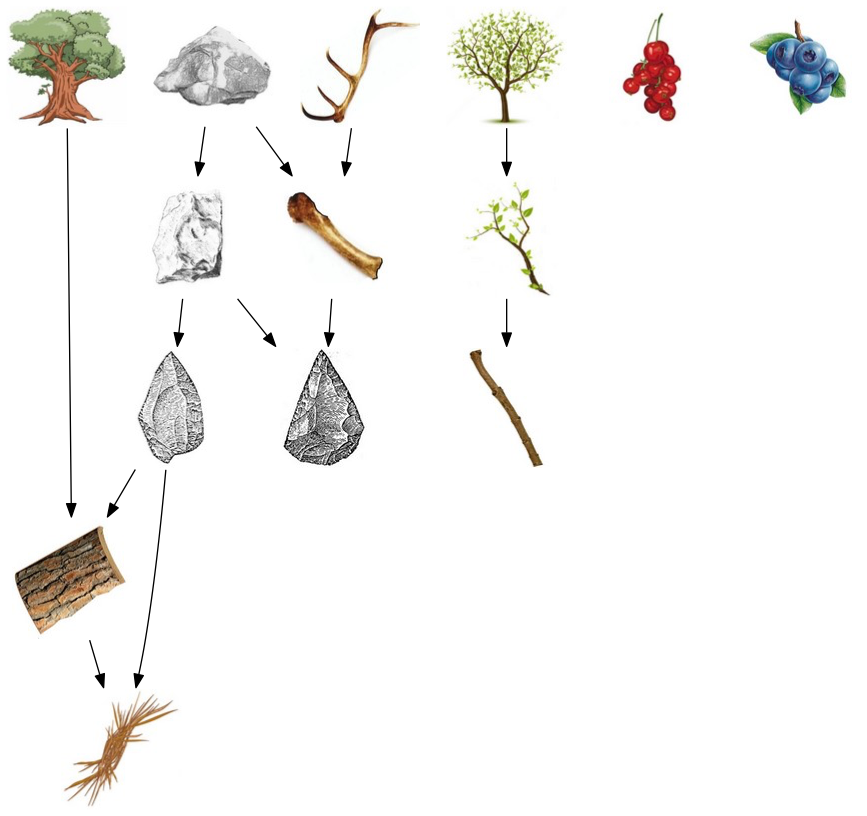

# diachronic teams

This research project investigates the impact of inheritance on the problem solving ability of individuals. The simplest form of inheritance considered is one person working on a solution to a problem for a time, and then passing the solution on to a second person to continue the work. Teamwork based around inheritance is referred to as **diachronic teamwork** which can be contrasted with **synchronic teamwork**, where teamwork is divided among the team members working in parallel. The goal of this project is to understand the conditions under which diachronic teamwork is a more effective use of labor hours than synchronic teamwork.

# Totems experiment

# Reproducible

Here's how I set up to work on this repository.

    # Clone the repository
    $ git clone https://github.com/pedmiston/diachronic-teams.git
    $ cd diachronic-teams

    # Setup a python virtualenv for the package
    $ mkvirtualenv --python=python3 teams -r requirements/teams.txt

    # List all available invoke tasks
    $ inv -l

Other requirements:

- "tidyverse" of R packages
- pandoc for dynamic documents
- graphviz for node/edge diagrams
